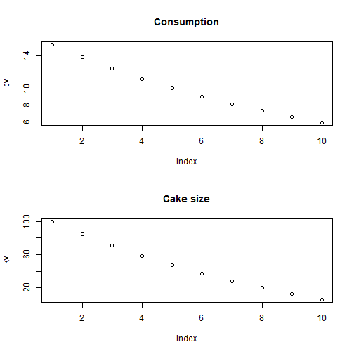
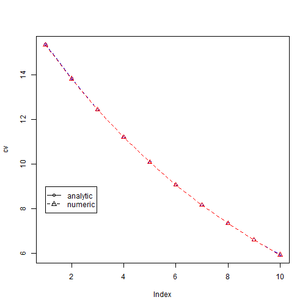

% Econ I Module
% Juergen Jung
% Towson University, 2012

# The cake eating problem

Once upon a time there was a little girl who got a cake. The girl decided to eat
the cake all alone. But she was not sure when she wanted to eat the cake. First,
she thought of eating the whole cake right away. But then, nothing would be left for 
tomorrow and the day after tomorrow.

Well, on the one hand, eating cake today is better than eating eat it tomorrow.
On the other hand, eating too much at the same time might not be the best.
She imagined that the first mouthful of cake is a real treat, the second is great,
the third is also nice. But the more you eat, the less you enjoy it. 

So, she decided to eat only a bit of the
cake everyday. Then, she could eat everyday another first mouthful of cake.
The girl knew that the cake would be spoiled if she kept it more than nine
days. Therefore, she would eat the cake in the first ten days. Yet, how much
should she eat everyday?

-------------------------------------------------------------------------------
# Solution

* She thought of eating everyday a piece of the same size. 
* But if eating cake today is better than waiting for tomorrow, how can it possibly 
be the best to do the same today as tomorrow? 
* If I ate just a little bit less tomorrow and a little bit more today I would be 
better off, she concluded.

*  And she would eat everyday a bit less than the previous day and the cake
would last ten days long and nothing would be left in the end

-------------------------------------------------------------------------------
# Formally

* Assume preferences in every period $latex t$ follow: $latex u(c_t) = ln(c_t)$ 
* $latex c_t$ is the amount of cake consumed in period $latex t$
* Futureconsumption is discounted with the time-preference factor $latex \beta< 1$. 
* The present value in period 0 of the whole consumption path is: 

$$latex V( c_1 ,c_2 ,...,c_T ) = \sum_{t=1}^{T} \beta^{t} U(c_t) $$ 

* The person tries to maximize this by choosing its consumption in period $latex t=0,..,T$

-------------------------------------------------------------------------------
# Formally

* The cake size in the next period $latex t+1$ is the size today less the consumption today

$$latex k_{t+1} = k_{t} - c_{t} $$

* Therefore, the cake size must be nonnegative in any period:

$$latex k_t \ge 0$$

-------------------------------------------------------------------------------
# Analytical solution

* Substituting the contraint into the life-time consumption path we get:

$$latex \beta^t U(k_{t-1} - k_{t})+ \beta^{t+1}  U(k_{t} - k_{t+1}) $$

* Deriving this objective function w.r.t. $latex k_t$ we get:

$$latex U'(c_{t-1}) = \beta U'(c_{t}) $$

* This is the so called 'Euler Equation'

-------------------------------------------------------------------------------
# Euler equation

$$latex U'(c_{t}) = \beta U'(c_{t+1}) $$
* The Euler equation has an intuitive interpretation 
* At a utility maximum, the consumer cannot gain from feasible shifts of consumption between periods
* A one-unit reduction in period $latex t$ consumption lowers $latex U_t$ by $latex U'_t$. 
* This unit saved can be shifted to period  $latex t+1$ where it raises utility by $latex U'_{t+1}$ discounted to period $latex t$, that is: $latex \beta U'_{t+1}$ 
* In the optimum these two quantities must be equal 

-------------------------------------------------------------------------------
# Solving the problem

* Pluging the functional for into the Euler equation we get:

$$latex c_{t+1} = \beta c_{t}$$

* In the optimum we know that: $latex k_{T+1} = 0$
* Recursively plugging the budget constraint into the Euler equation we get:

$$latex c_0=\frac{1-\beta}{(1-\beta)^{T+1}}k_0 $$

* We can now map out the optimal consumption for any size cake: $latex k_0$

-------------------------------------------------------------------------------
# Solving the problem: analytics

* $latex c_T = k_T$ in the last period, eat entire cake
* $latex c_{T-1}$ we get by:
    1. Substituting the Euler equation we have: $latex c_{T-1}=\frac{1}{\beta} c_T=\frac{1}{\beta} k_T$
    2. Substituting the budget constraint: $latex c_{T-1}=\frac{1}{\beta} (k_{T-1} - c_{T-1})$
    3. Which can be solved for: $latex c_{T-1}=\frac{1}{1+\beta} k_{T-1}$ 
* Continue with this and find: $latex c_{T-T} = \frac{1}{1+\beta + \beta^2 +...+\beta^T} k_{T-T}$
* Using: $latex \sum_{t=1}^{T}\beta^t = \frac{1-\beta^{T+1}}{1-\beta}$, we get
* $latex c_0=\frac{1-\beta}{(1-\beta)^{T+1}}k_0$

-------------------------------------------------------------------------------
# Plotting the solution

* For any size $latex k+0$ and time horizon $latex T$ we can now calculate the optimal consumption in each period
* Example: $latex k_0 = 50$, $latex T=10$, and $latex \beta = 0.96$


```r
T = 9
beta = 0.9
kv = seq(T + 1)
cv = seq(T + 1)
uv = seq(T + 1)
kv[1] = 100  # k0
cv[1] = (1 - beta)/(1 - beta^(T + 1)) * kv[1]  # c0
uv[1] = log(cv[1])
for (i in 2:(T + 1)) {
    cv[i] = beta * cv[i - 1]
    kv[i] = kv[i - 1] - cv[i - 1]
    uv[i] = beta^(i - 1) * log(cv[i])  # period utility with discounting
}
```


-------------------------------------------------------------------------------
# Plots of consumption and cake size


```r
par(mfrow = c(2, 1))
plot(cv)
title("Consumption")
plot(kv)
title("Cake size")
```

 


-------------------------------------------------------------------------------
# Numerical solution    

* For a numerical solution we use the ``Rsolnp`` package

* The routine ``solnp`` minimizes constrained non-linear functions

* The constraints can be equality or inequality constraints

* Our problem has one equality constraint: 

* We define the objective function ``func1`` as:
    
$$latex \sum_{t=0}^{T}\beta^{t} U(c_t) $$
    
* The constraint is defined as function ``eqn1``: 
    
$$latex c_0+c_1+...+c_T=k_0 $$

-------------------------------------------------------------------------------
# Function definitions

The objective function: 


```r
func1 = function(cv) {
    T = length(cv)
    uv = seq(T)
    for (i in 1:T) {
        beta = 0.9
        uv[i] = beta^(i - 1) * log(cv[i])  # period utility with discounting
    }
    return(-sum(uv))
}
```


-------------------------------------------------------------------------------
# Function definitions
    
The constraint:


```r
eqn1 = function(cv) {
    k0 = 100
    z1 = sum(cv) - k0
    return(c(z1))
}
```


-------------------------------------------------------------------------------
# Function definitions

Call the optimizer with some starting values for the consumption vector


```r
library("Rsolnp")
T = 10
x0 = array(1, c(1, T)) * 0.1
cake = solnp(x0, fun = func1, eqfun = eqn1, eqB = c(0))
```

```
## 
## Iter: 1 fn: -15.2874	 Pars:  15.33302 13.81260 12.44022 11.20158 10.08394  9.07547  8.16574  7.34511  6.60493  5.93740
## Iter: 2 fn: -15.2874	 Pars:  15.33314 13.81265 12.44021 11.20154 10.08387  9.07539  8.16568  7.34508  6.60495  5.93749
## Iter: 3 fn: -15.2874	 Pars:  15.33325 13.81270 12.44020 11.20149 10.08380  9.07532  8.16562  7.34505  6.60497  5.93759
## solnp--> Completed in 3 iterations
```

```r
# Plot analytical and numerical solution
par(mfrow = c(1, 1))
plot(cv, type = "o", pch = 1, lty = 2, col = "blue")
# Numerical soln
lines(cake$pars, type = "o", pch = 2, lty = 2, col = "red")
legend(1, 9, c("analytic", "numeric"), pch = c(1, 2), lty = c(1, 
    2))
```

 

```r
cat("Analytic solution cv =", cv)
```

```
## Analytic solution cv = 15.35 13.82 12.44 11.19 10.07 9.066 8.159 7.343 6.609 5.948
```

```r
cat("Numeric soluntion cv =", cake$pars)
```

```
## Numeric soluntion cv = 15.33 13.81 12.44 11.2 10.08 9.075 8.166 7.345 6.605 5.938
```


-------------------------------------------------------------------------------
# Python

```python
import math
from pylab import *

T = 9
beta = 0.9
kv = zeros(T+1,float)
cv = zeros(T+1,float)
uv = zeros(T+1,float)
kv[0] = 100                            # k0
cv[0] = (1.0-beta)/(1.0-beta**(T+1)) * kv[0]  # c0
uv[0] = log(cv[0])

for i in range(1,T+1):
    #print "i=" + str(i)
    cv[i] = beta * cv[i-1]
    kv[i] = kv[i-1] - cv[i-1]
    uv[i] = beta**(i-1)*log(cv[i])  # period utility with discounting

sum(uv)  # total utility

print "cv= " +str(cv)
print "kv= " +str(kv)
```
```
cv= [ 15.35339933  13.8180594   12.43625346  11.19262811  10.0733653
   9.06602877   8.15942589   7.3434833    6.60913497   5.94822148]
kv= [ 100.           84.64660067   70.82854128   58.39228782   47.19965971
   37.12629441   28.06026564   19.90083975   12.55735645    5.94822148]
```


-------------------------------------------------------------------------------
Plotting is achieved via:

```
fig1 = figure()
subplot(2,1,1)
plot(cv)
ylabel("c_t")
xlabel("Period t")
title("Consumption")
#
subplot(2,1,2)
plot(kv)
title("Cake size")
ylabel("k_t")
xlabel("Period t")
show()
```

-------------------------------------------------------------------------------
# Numerical solution in Python

Define functions:

```
def func1(cv):
    T = len(cv)
    uv= zeros(T,float)
    for i in range(T):
        beta = 0.9
        uv[i] = (beta**i) * log(cv[i])  # period utility with discounting
    return (-sum(uv))
```

```
# The constraint
def eqn1(cv):
    k0 = 100
    z1=sum(cv) - k0
    return array([z1])
```

-------------------------------------------------------------------------------
# Optimizer in ```optimize``` toolbox

```
T = 10
x0 =ones(T,float)*0.1
coptv= optimize.fmin_slsqp(func1, x0, f_eqcons = eqn1)  #, f_eqcons = eqn1
```

-------------------------------------------------------------------------------

```
# Plot analytical and numerical solution
fig2 = figure()
plot(arange(0,T), cv, 'b-', arange(0,T), coptv, 'r--')
title("Optimal consumption")
xlabel("Period t")
ylabel("c_t")
# Create a legend 
legend(('analytical', 'numerical'),'lower right', shadow=True) 
print ('Analytic solution cv =' + str(cv))
print ('Numeric soluntion cv =' + str())
```
