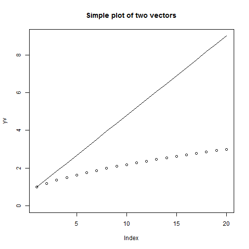

--------------------------------------------------
# Basic programming techniques

In this chapter we explore some basic programming techniques.


```r
rm(list = ls())  # Remove almost everything in the memory
setwd("C:/Dropbox/Towson/Teaching/3_ComputationalEconomics/Lectures/Lecture3/R")
```

```
## Error: cannot change working directory
```


--------------------------------------------------------------------------------
# 1 Branching

The ```if``` command can be used to check whether a certain condition is true. If it is true, then we can assign a certain chain of commands for this eventuality. If the condition is wrong, we can branch off our program into another direction and assign different commands. So we can basically branch our program into two (or more) seperate directions.
Here is a simple example. We first draw some random number between 0 and 1 using the ```runif()``` command. We then check whether the number is smaller or larger than 0.5. For each eventuality we can then assign a string of commands to be executed.


```r
x = runif(1)  # draw a random number between 0 and 1
if (x > 0.5) {
    # Do this whenever x is larger than 0.5
    cat("Number x=", x, " is greater than 0.5 \n")
    # do more do even more etc.
    
} else {
    # Do this whenever x is NOT larger than 0.5
    cat("Number x=", x, " is smaller than or equal to 0.5 \n")
    # do more do even more etc.
}
```

```
## Number x= 0.5949  is greater than 0.5 
```


We next branch the program into 3 seperate directions depending on 3 mutually exclusive conditions.


```r
x = runif(1)
y = runif(1)

if (x > y) {
    cat("X is greater than Y \n")
} else if (x == y) {
    cat("X is equal to Y \n")
} else if (x < y) {
    cat("X is smaller than Y \n")
}
```

```
## X is smaller than Y 
```


--------------------------------------------------------------------------------
# 2 For loops

If we want to do repeated tasks we use loops insteady of copy/pasting the same series of commands.

--------------------------------------------------------------------------------
## Loop 1
Here is a simple first example. We first assign a vector with values 1, 3, 5, 7, and 9 as values. We then "loop" through all the values of this vector and print them. In addition, we add up all the values of this vector one by one. The command ```for (x in xv)``` assigns ```x``` equal to each value of ```xv``` one by one and we can then use ```x``` itself in each iteration. With this we can step through all the values of our vector and assign certain operations to each value.


```r
xv = seq(1, 9, by = 2)
sumx = 0

for (x in xv) {
    # In the first round x = xv[1] In the second round (i.e. iteration) x =
    # xv[2] etc.
    sumx = sumx + x  # adds up the elements in vector xv
    #
    cat("X =", x, "\n")
    cat("sum(x) = ", sumx, "\n")
}
```

```
## X = 1 
## sum(x) =  1 
## X = 3 
## sum(x) =  4 
## X = 5 
## sum(x) =  9 
## X = 7 
## sum(x) =  16 
## X = 9 
## sum(x) =  25 
```


The same operation can be done much simpler, of course, using the ```sum(xv)``` command. 

--------------------------------------------------------------------------------
## Loop 2

Here is another example. We write a loop that calculates the factorial of a number: $latex 3!$. Remember that $$3! = 1 * 2 * 3$$.
In order to make this happen we write a loop that sets i = 1, 2, and 3 and multiplies it with the product of the previous round. The variable ```n_fac``` stores the product from each round.


```r
n = 6
n_fac = 1

for (i in 1:n) {
    cat("i = ", i, "\n")
    # The 'new' factorial of this round is equal to the 'old' factorial of the
    # previous round multiplied with the current value of i. Where i = 1,2,
    # and 3.
    n_fac = n_fac * i
    cat("n_fac = ", n_fac, "\n")
}
```

```
## i =  1 
## n_fac =  1 
## i =  2 
## n_fac =  2 
## i =  3 
## n_fac =  6 
## i =  4 
## n_fac =  24 
## i =  5 
## n_fac =  120 
## i =  6 
## n_fac =  720 
```

```r
cat("The factorial of ", n, " is: ", n_fac, "\n")
```

```
## The factorial of  6  is:  720 
```


--------------------------------------------------------------------------------
## Loop 3

Finally, here is an example where we loop through the values of a vector again. In each round we reach the value of the vector and print it. 


```r
xv = seq(1, 9, length = 20)
print(xv)
```

```
##  [1] 1.000 1.421 1.842 2.263 2.684 3.105 3.526 3.947 4.368 4.789 5.211
## [12] 5.632 6.053 6.474 6.895 7.316 7.737 8.158 8.579 9.000
```


We now start the loop and pick each value of this vector one-by-one. The command ```length``` tells us how many arguments are in vector ```xv``` and then lets the loop run from 1 to the totoal number of arguments in ```xv```.


```r
for (i in 1:length(xv)) {
    cat("i= ", i, "\n")
    cat("xv[i]= ", xv[i], "\n")
    cat("sqrt(xv[i])= ", sqrt(xv[i]), "\n")
}
```

```
## i=  1 
## xv[i]=  1 
## sqrt(xv[i])=  1 
## i=  2 
## xv[i]=  1.421 
## sqrt(xv[i])=  1.192 
## i=  3 
## xv[i]=  1.842 
## sqrt(xv[i])=  1.357 
## i=  4 
## xv[i]=  2.263 
## sqrt(xv[i])=  1.504 
## i=  5 
## xv[i]=  2.684 
## sqrt(xv[i])=  1.638 
## i=  6 
## xv[i]=  3.105 
## sqrt(xv[i])=  1.762 
## i=  7 
## xv[i]=  3.526 
## sqrt(xv[i])=  1.878 
## i=  8 
## xv[i]=  3.947 
## sqrt(xv[i])=  1.987 
## i=  9 
## xv[i]=  4.368 
## sqrt(xv[i])=  2.09 
## i=  10 
## xv[i]=  4.789 
## sqrt(xv[i])=  2.188 
## i=  11 
## xv[i]=  5.211 
## sqrt(xv[i])=  2.283 
## i=  12 
## xv[i]=  5.632 
## sqrt(xv[i])=  2.373 
## i=  13 
## xv[i]=  6.053 
## sqrt(xv[i])=  2.46 
## i=  14 
## xv[i]=  6.474 
## sqrt(xv[i])=  2.544 
## i=  15 
## xv[i]=  6.895 
## sqrt(xv[i])=  2.626 
## i=  16 
## xv[i]=  7.316 
## sqrt(xv[i])=  2.705 
## i=  17 
## xv[i]=  7.737 
## sqrt(xv[i])=  2.782 
## i=  18 
## xv[i]=  8.158 
## sqrt(xv[i])=  2.856 
## i=  19 
## xv[i]=  8.579 
## sqrt(xv[i])=  2.929 
## i=  20 
## xv[i]=  9 
## sqrt(xv[i])=  3 
```


We next plot the 2 vectors using the ```plot``` command.


```r
yv = sqrt(xv)
plot(yv, ylim = c(0, 9))
lines(xv)
title("Simple plot of two vectors")
```

 

--------------------------------------------------------------------------------
# 3 While loop

The while loop runs and keeps repeating to do something until a certain stopping condition is met.

--------------------------------------------------------------------------------
## While loop 1

In the first example we let the iterations run as long as the value of variable x is smaller than 10. In every iteration we increase x by one unit, so that in effect the loop gets repeated 9 times.


```r
x = 0
y = 0
while (x < 10) {
    y = y + x
    cat("X= ", x, " and Y= ", y, "\n")
    x = x + 1
}
```

```
## X=  0  and Y=  0 
## X=  1  and Y=  1 
## X=  2  and Y=  3 
## X=  3  and Y=  6 
## X=  4  and Y=  10 
## X=  5  and Y=  15 
## X=  6  and Y=  21 
## X=  7  and Y=  28 
## X=  8  and Y=  36 
## X=  9  and Y=  45 
```


Variable ```y``` calculates the cumulative sum of all numbers from 1 to 9, so that $latex y = 0+1+2+...+9$.

## While loop 2

In this last example we calculate how long it takes to repay a loan. The longer you wait to repay the loan, the more interest is accumulated and added to the outstanding debt. The key formula in this example is: $$latex debt_{tomorrow} = debt_{today}*(1 + interest rate) - payments_{today}$$


```r
r = 0.11  # annual interest rate
period = 1/12  # time between repayments in years (i.e. monthly repayments)
debt_initial = 1000  # initial debt
payments = 12  # amount repaid each period

mytime = 0
debt = debt_initial
while (debt > 0) {
    mytime = mytime + period
    debt = debt * (1 + r * period) - payments
}
cat("Loan will be repaid in: ", mytime, " years. \n")
```

```
## Loan will be repaid in:  13.25  years. 
```


--------------------------------------------------------------------------------
# Exercises

1. Define the following function f(x) on its domain from $latex -5<= x <= 5$. If $latex x>=1$ then $latex f(x)=ln(x)$. If $latex x<1$ then $latex f(x)=x^2$. 
2. Plot this function over its domain.
