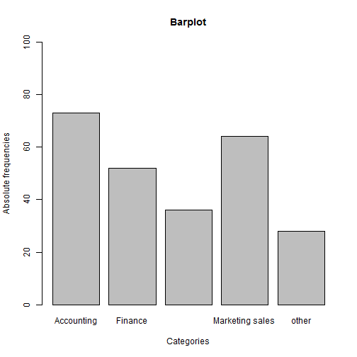
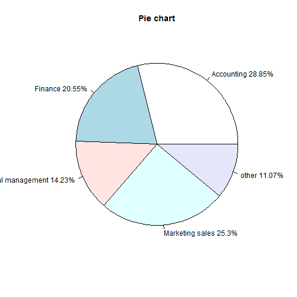
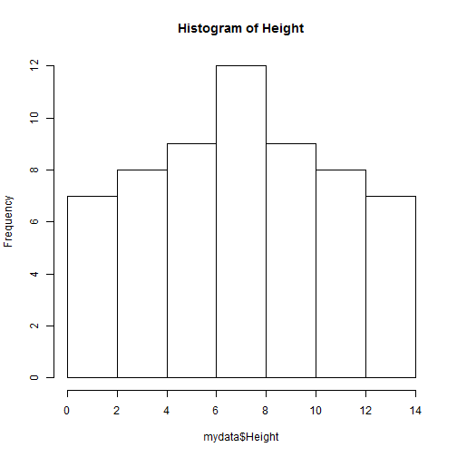
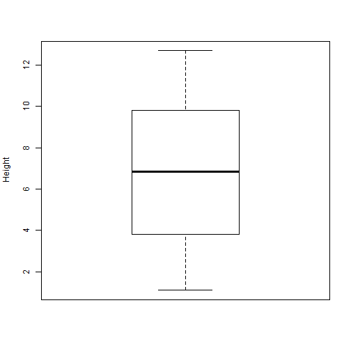
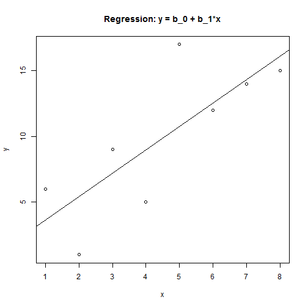

# A Import data and standard statistics functionality in R


# 1 Read in small data set from a comma separated (.csv) file

We use the ```read.csv``` command to read in the data file **Lecture_4_excel_a.csv**. This command is part of the library ```foreign```. So we have to load this library first.


```r
rm(list = ls())  # Remove almost everything in the memory
library(foreign)  # Load foreign library
setwd("C:/Dropbox/Towson/Teaching/3_ComputationalEconomics/Lectures/Lecture4/Slides/")
#
mydata = read.csv("Lecture_4_Excel_a.csv", header = T)  # Data has headers, so we set this to 'true'
View(mydata)  # Let's look at our data set
```


The data is currently saved in a so called **data frame**. This is a very convenient R specific concept. Our data consists of 3 variables total: ```Area``` and ```Frequency```.
We can access each one of these variables by adding the name of the data frame separated by the dollar sign. So if you'd like to manipulate variable Frequency you could do so by writing: ```mydata$Frequency```. Try


```r
sum(mydata$Frequency)
```

```
## [1] 253
```


We next generate a new variable called ```X``` that contains the relative frequencies.


```r
mydata$X = mydata$Frequency/sum(mydata$Frequency)  # Generate a new variable in mydata call
View(mydata)
```


# 2 Making simple graphs from our data

## 2.1 Bar chart

We first make a bar chart of the absolute frequencies.


```r
barplot(mydata$Frequency, main = "Barplot", xlab = "Categories", 
    ylab = "Absolute frequencies", ylim = c(0, 100), names.arg = mydata$Area)
```

 

This simple command plots the barchart into a window. As you can see we are able to add titles etc. Next we want to save the graph as a **.pdf** file so that we can copy it into our reports. We save it into a subfolder to the current directly called ```Graphs```. Don't forget to first make this subfolder, otherwise ```R``` will throw an error when it can't find the saving location.

```{R5}
# write this graps into a .pdf file and save it in a subfolder
   pdf(file="./R/Graphs/Fig1_R.pdf")
   barplot(mydata$Frequency, main = "Barplot", xlab = "Categories", 
        ylab = "Absolute frequencies" , ylim = c(0, 100), names.arg = mydata$Area)
   dev.off()
```
## 2.2 Pie chart
We next make a pie chart using the relative frequencies stored in variable ```X```.


```r
lbls = paste(mydata$Area, round(mydata$X, 4) * 100)  # add percent to labels
lbls = paste(lbls, "%", sep = "")  # add % to labels
pie(mydata$X, main = "Pie chart", labels = lbls)
```

 

## 2.3 Histogram
Next we use a new data file called **Lecture_4_Excel_b.csv**. This data file contains data on height age and other variables. We first make a histogram of the continuous variable Height.


```r
setwd("C:/Dropbox/Towson/Teaching/3_ComputationalEconomics/Lectures/Lecture4")
mydata <- read.csv("Lecture_4_Excel_b.csv", header = T)
View(mydata)
hist(mydata$Height, main = "Histogram of Height")
```

 


## 2.4 Boxplots
A boxplot of height is made as follows:


```r
boxplot(mydata$Height, ylab = "Height")
```

 

-----------------------------------------------------------
# 3. Summary statistics

We next go through some basic summary statistics.

## 3.1 Measures of central tendency

We first calculate the mean, median and mode.


```r
n = length(mydata$Height)
sum(mydata$Height)/n  # average
```

```
## [1] 6.817
```

```r
# or simply
mean(mydata$Height)
```

```
## [1] 6.817
```

```r

# Median
median(mydata$Height)
```

```
## [1] 6.85
```

```r

# Mode (value with highest frequency)
mode(mydata$Height)
```

```
## [1] "numeric"
```


We can also just summarize a variable in our data frame with the ```summary``` command.


```r
summary(mydata$Height)
```

```
##    Min. 1st Qu.  Median    Mean 3rd Qu.    Max. 
##    1.10    3.95    6.85    6.82    9.65   12.70 
```


## 3.2 Measures of dispersion

We now calculate the range, variance and standard deviations. Remember that for variance and standard deviation there is a distinction between population and sample.


```r
range(mydata$Height)  # returns smallest a largest element
```

```
## [1]  1.1 12.7
```

```r
diff(range(mydata$Height))  # returns (largest-smallest)
```

```
## [1] 11.6
```

```r

sum((mydata$Height - mean(mydata$Height))^2)/n  # population variance
```

```
## [1] 12.54
```

```r
sum((mydata$Height - mean(mydata$Height))^2)/(n - 1)  # sample variance
```

```
## [1] 12.76
```

```r
var(mydata$Height)
```

```
## [1] 12.76
```

```r
sqrt(var(mydata$Height))
```

```
## [1] 3.572
```

```r
sd(mydata$Height)
```

```
## [1] 3.572
```


The coefficient of variation is a measure of risk. You can calculate it as a normalized standard deviation: $$ CV = \frac{\sigma}{\mu} $$


```r
sd(mydata$Height)/mean(mydata$Height)  # CV ... coefficient of variation
```

```
## [1] 0.524
```


## 3.3 Measures of relative standing

Percentiles are calculated as follows:


```r
quantile(mydata$Height, 0.25)
```

```
##  25% 
## 3.95 
```

```r
quantile(mydata$Height, c(0.25, 0.5, 0.75))
```

```
##  25%  50%  75% 
## 3.95 6.85 9.65 
```

```r
quantile(mydata$Height)
```

```
##    0%   25%   50%   75%  100% 
##  1.10  3.95  6.85  9.65 12.70 
```

```r
IQR(mydata$Height)  # Inter quartile rante: Q3-Q1 or P_75-P_25
```

```
## [1] 5.7
```


---------------------------------------------------------
# 4 Measures of linear relationship

## 4.1 Covariance


```r
n = length(mydata$Age)
x = mydata$Age
y = mydata$Height

sum((x - mean(x)) * (y - mean(y)))/n  # Population covariance
```

```
## [1] -0.1589
```

```r
sum((x - mean(x)) * (y - mean(y)))/(n - 1)  # sample covariance
```

```
## [1] -0.1616
```

```r
# or simply
cov(x, y)
```

```
## [1] -0.1616
```


## 4.2 Correlation coefficient


```r
cov(x, y)/(sd(x) * sd(y))
```

```
## [1] -0.03844
```

```r
# or simply
cor(x, y)
```

```
## [1] -0.03844
```


## 4.3 Regression line

### Example 1: Simple example

We first generate some data. A variable ```x``` and a variable ```y```.


```r
x = (1:8)
y = c(6, 1, 9, 5, 17, 12, 14, 15)
```


We then run a regression of the form: $$y = \beta_0 + \beta_1 * x + \epsilon$$. The command for this OLS regression is: ```lm(y~x)``` where ```y``` is the dependent variable and ```x``` is the independent variable.


```r
res = lm(y ~ x)  # runs regression
```


We fist make a **scatterplot** with least squares trend line.


```r
plot(x, y, main = "Regression: y = b_0 + b_1*x")
abline(res)
```

 

We next calculate the  coefficient of determination $$R^2$$ by summarizing the residuals of our regression.


```r
summary(res)
```

```
## 
## Call:
## lm(formula = y ~ x)
## 
## Residuals:
##    Min     1Q Median     3Q    Max 
## -4.440 -1.810 -0.423  1.923  6.238 
## 
## Coefficients:
##             Estimate Std. Error t value Pr(>|t|)  
## (Intercept)     1.89       2.93    0.65    0.542  
## x               1.77       0.58    3.06    0.022 *
## ---
## Signif. codes:  0 '***' 0.001 '**' 0.01 '*' 0.05 '.' 0.1 ' ' 1 
## 
## Residual standard error: 3.76 on 6 degrees of freedom
## Multiple R-squared: 0.609,	Adjusted R-squared: 0.544 
## F-statistic: 9.36 on 1 and 6 DF,  p-value: 0.0222 
## 
```


Finally, we use the model to make a prediction of ```y``` when ```x=8.5```.


```r
# Prediction: size of 8.5 will produce a math score of ...
betas = coef(res)
cat("Prediction for y of x=8.5 is:", sum(betas * c(1, 8.5)))
```

```
## Prediction for y of x=8.5 is: 16.97
```


-------------------------
### Example 2: OLS with categorical (dummy variables)

The next example is a bit more involved as we increase the number of explanatory variables. In addition, some explanatory variables are categorical variables. In order to use them in our OLS regression we first have to make so called **dummy** variables (i.e. indicator variables that are either 0 or 1). This is very easy to do in **R** as we simply use the ```as.factor()``` command inside the linear regression command ```lm()```.


```r
res = lm(mydata$AverageMathSAT ~ mydata$Height + mydata$Age + as.factor(mydata$Female) + 
    as.factor(mydata$Race))  # type res to see output table

# R^2: Coefficient of determination
summary(res)
```

```
## 
## Call:
## lm(formula = mydata$AverageMathSAT ~ mydata$Height + mydata$Age + 
##     as.factor(mydata$Female) + as.factor(mydata$Race))
## 
## Residuals:
##    Min     1Q Median     3Q    Max 
## -45.52  -4.06   1.14   5.41  26.07 
## 
## Coefficients:
##                            Estimate Std. Error t value Pr(>|t|)    
## (Intercept)                  486.29      78.21    6.22  8.7e-08 ***
## mydata$Height                 13.51       1.94    6.98  5.3e-09 ***
## mydata$Age                    -3.15       4.04   -0.78   0.4385    
## as.factor(mydata$Female)1    -45.40      17.40   -2.61   0.0118 *  
## as.factor(mydata$Race)Hisp   -22.58       7.00   -3.23   0.0022 ** 
## as.factor(mydata$Race)Mex      0.84       4.29    0.20   0.8455    
## as.factor(mydata$Race)Oth      0.38       9.40    0.04   0.9679    
## as.factor(mydata$Race)Wht     -8.15       4.19   -1.95   0.0569 .  
## ---
## Signif. codes:  0 '***' 0.001 '**' 0.01 '*' 0.05 '.' 0.1 ' ' 1 
## 
## Residual standard error: 12.6 on 52 degrees of freedom
## Multiple R-squared: 0.879,	Adjusted R-squared: 0.862 
## F-statistic: 53.8 on 7 and 52 DF,  p-value: <2e-16 
## 
```

```r

# Prediction: size of 2.5, 22 years of age, female, race=other will
# produce a math score of ...
betas = coef(res)
sum(betas * c(1, 2.5, 22, 1, 0, 0, 1, 0))
```

```
## [1] 405.7
```


