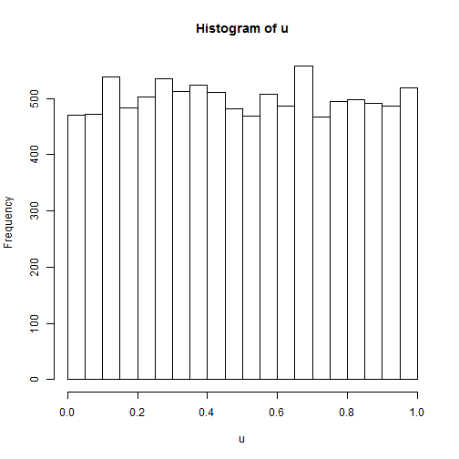
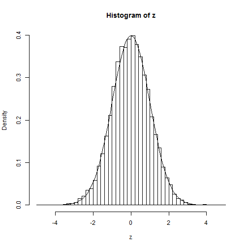
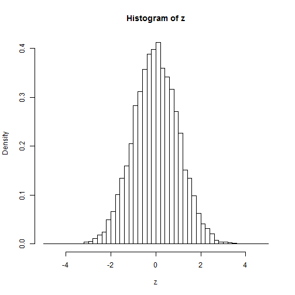
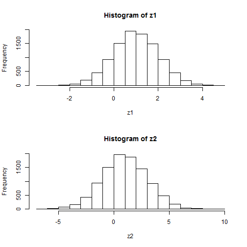
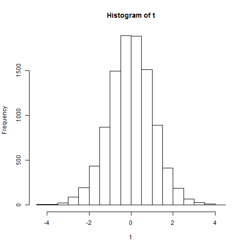

# Random numbers


```r
rm(list = ls())  # Remove almost everything in the memor
set.seed(100)  # To always get the same random numbers on each run (makes results reproducible)
```


-------------------------------------------------------------------------------
# 1 Uniform distributed random numbers


```r
u = runif(10000)
hist(u)
```

 


-------------------------------------------------------------------------------
# 2 Normally distributed random numbers


```r
z = rnorm(10000)  # draws 10,000 standard normally distributed random numbers
hist(z, breaks = seq(-5, 5, 0.2), freq = F)
phi = function(x) exp(-x^2/2)/sqrt(2 * pi)  # density function of standard normal
x = seq(-5, 5, 0.1)
lines(x, phi(x))
```

 

## 2.1 Using inverse CDF
For instance, if you want to simulate from a standard normal distribution, you can simulate from a standard uniform and transform it using the quantile function of the normal distribution.


```r
N = 10000
z = qnorm(runif(N))
hist(z, breaks = seq(-5, 5, 0.2), freq = F)
```

 


## 2.2 Two normally distributed random variables


```r
z1 = rnorm(10000, mean = 1, sd = 1)
z2 = rnorm(10000, mean = 1, sd = 2)

par(mfrow = c(2, 1))  # Set up plotting in 3rows and 2 columns, plotting along rows first.

hist(z1)
hist(z2)
```

 

-------------------------------------------------------------------------------
# 3 T-distributed random variable


```r
par(mfrow = c(1, 1))
t = rt(10000, 20)
hist(t)
```

 

-------------------------------------------------------------------------------
# 4 Other distributions

We can generate random numbers using ```r.....``` and then substitute the R-name listed below. So for a Cauchy distributed random variable we'd use: ```rcauchy``` for Gamma we'd use: ```rgamma``` etc.

distribution  |    R-name
------------- | -------------
Beta          |    Beta	    
Binomial	    |    binom	    
Cauchy	      |    cauchy	    
Chisquare	    |    Chisquare	
Exponential	  |    exp	        
F	             |   f	        
Gamma	         |   gamma	    
Geometric	    |   geom	    
Hypergeom.	   |     hyper	    
Logistic	      |  logis	 	 
Lognormal	      |  lnorm
Negative Binomial | 	nbinom
Normal	       |   norm
Poisson	        |  pois
tudent t 	      |  t
Uniform	         |   unif
Tukey	           | tukey
Weibull	         | weib
Wilcoxon	       | wilcox


## Exercise: Central limit theorem
-------------------------------------------------------------------------------

The central limit theorem says that sample averages from random samples of just any distribution, follow a normal distribution:
$$latex \bar{x} \sim N(\mu, \frac{\sigma}{\sqrt{n}})$$ 

Let's verify this claim.

    1. Assume a random variable is $latex X \sim U[20,60]
    1. According to the CLT the sample averages should follow a Normal distribution with $latex \mu = \frac{a+b}{2}$ and $latex \sigma = \sqrt{\frac{1}{12}(b-a)^2}$
    3. Draw 1,000 samples of size n=80 from a uniform distribution and calculate the sample mean each time. Collect sample means in vector xmeanv.
    4. Make a histogram of this vector
    
    
    
    
    
    
    
    
    
    
    
    
    
    
    
    
    
    
    
    
    
    
    
    
