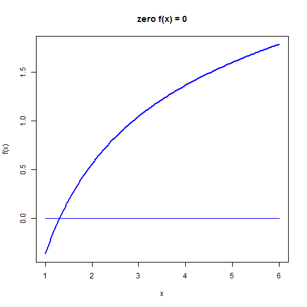

# Root finding

# 1 First steps


```r
rm(list = ls())  # Remove almost everything in the memor
```


## 1.1 Define example function

Define am example function for which we calculate the root, i.e. find x so that f(x) = 0


```r
func = function(x) {
    fx = log(x) - exp(-x)  # function: f(x)
    return(fx)  # return function value
}
```


Define the same function  but this time we return the functional value and the first derivate of the function (i.e. the gradient).


```r
func1 = function(x) {
    fx = log(x) - exp(-x)  # function: f(x)
    dfx = 1/x + exp(-x)  # derivative of function: f'(x)
    return(c(fx, dfx))  # return function value and value of derivative
}
```


## 1.2 Plot the function


```r
xmin = 1
xmax = 6
x = seq(xmin, xmax, (xmax - xmin)/200)
fx = c()  # define column vector
for (i in 1:length(x)) {
    fx[i] = func1(x[i])[1]
}
plot(x, fx, type = "l", xlab = "x", ylab = "f(x)", main = "zero f(x) = 0", 
    col = "blue", lwd = 2)
lines(c(xmin, xmax), c(0, 0), col = "blue")
```

 


-------------------------------------------------------------------------------
# 2 Newton-Raphson

## 2.1 The method

We start with an initial guess $latex x_0$. The tangent line through the initial guess can be defined as:

$$latex f'(x_0)=\frac{f(x_0)-y}{x_0-x}$$
This line crosses the x-axis at point $latex x_1$ so that
$$latex f'(x_0)=\frac{f(x_0)-0}{x_0-x_1}$$ 
which we can solve for $latex x_1$ as:
$$latex x_1 = x_0 - \frac{f(x_0)}{f'(x_0)}.$$
We can repeat this successively using the iterative procedure:
$$latex  \boxed{x_{n+1} = x_n - \frac{f(x_n)}{f'(x_n)}}$$

## 2.2 Define the Newton-Raphson algorithm


```r
newtonraphson = function(ftn, x0, tol = 1e-09, max.iter = 100) {
    # Newton_Raphson algorithm for solving ftn(x)[1] == 0 we assume that ftn
    # is a function of a single variable that returns the function value and
    # the first derivative as a vector of length 2
    # 
    # x0 is the initial guess at the root the algorithm terminates when the
    # function value is within distance tol of 0, or the number of iterations
    # exceeds max.iter
    
    # initialise
    x = x0
    fx = ftn(x)
    iter = 0
    
    # continue iterating until stopping conditions are met
    while ((abs(fx[1]) > tol) && (iter < max.iter)) {
        x = x - fx[1]/fx[2]
        fx = ftn(x)
        iter = iter + 1
        cat("At iteration", iter, "value of x is:", x, "\n")
    }
    
    # output depends on success of algorithm
    if (abs(fx[1]) > tol) {
        cat("Algorithm failed to converge\n")
        return(NULL)
    } else {
        cat("Algorithm converged\n")
        return(x)
    }
}
```


## 2.3 Calculate the root of the function calling 'newtonraphson'


```r
newtonraphson(func1, 2)
```

```
## At iteration 1 value of x is: 1.122 
## At iteration 2 value of x is: 1.295 
## At iteration 3 value of x is: 1.31 
## At iteration 4 value of x is: 1.31 
## At iteration 5 value of x is: 1.31 
## Algorithm converged
```

```
## [1] 1.31
```


-------------------------------------------------------------------------------
# 3 Secant method

## 3.1 Define the secant method

In this case we start with two starting values $latex x_0$ and $latex x_1$ and put a line through the functional values $latex f(x_0)$ and $latex f(x_1)$. The advantage of this method is that we do not have to calculate the first derivative of the function.The line through $latex f(x_0)$ and $latex f(x_1)$ is expressed as:
$$latex \frac{y-f(x_1)}{x-x_1} = \frac{f(x_0)-f(x_1)}{x_0-x_1}.$$

The point $latex x_2$ where this line crosses the x-axis can be found using:
$$latex \frac{0-f(x_1)}{x_2-x_1} = \frac{f(x_0)-f(x_1)}{x_0-x_1},$$
which results in
$$latex x_2 = x_1 - f(x_1)\frac{x_0-x_1}{f(x_0)-f(x_1)}.$$

The iterative procedure can be written as:
$$latex \boxed{x_{n+1} = x_n - f(x_n)\frac{x_{n-1}-x_n}{f(x_{n-1})-f(x_n)}}$$

Note that if $latex x_0$ and $latex x_1$ are close together then:
$$f'(x_n) \approx f(x_1)\frac{f(x_n)-f(x_{n-1})}{x_n-x_{n-1}}.$$


## 3.2 The algorithm of the secant method


```r
secant = function(ftn, x0, x1, tol = 1e-09, max.iter = 100) {
    # Secant algorithm for solving ftn(x) == 0 we assume that ftn is a
    # function of a single variable that returns the function value
    # 
    # x0 and x1 are the initial guesses around the root the algorithm
    # terminates when the function value is within distance tol of 0, or the
    # number of iterations exceeds max.iter
    
    # initialize
    fx0 = ftn(x0)
    fx1 = ftn(x1)
    iter = 0
    
    # continue iterating until stopping conditions are met
    while ((abs(fx1) > tol) && (iter < max.iter)) {
        x = x1 - fx1 * (x1 - x0)/(fx1 - fx0)
        fx0 = ftn(x1)
        fx1 = ftn(x)
        x0 = x1
        x1 = x
        
        iter = iter + 1
        cat("At iteration", iter, "value of x is:", x, "\n")
    }
    
    # output depends on success of algorithm
    if (abs(fx1) > tol) {
        cat("Algorithm failed to converge\n")
        return(NULL)
    } else {
        cat("Algorithm converged\n")
        return(x)
    }
}
```


## 3.3 Calculate the root of the function calling 'secant'


```r
secant(func, 1, 2)
```

```
## At iteration 1 value of x is: 1.397 
## At iteration 2 value of x is: 1.285 
## At iteration 3 value of x is: 1.311 
## At iteration 4 value of x is: 1.31 
## At iteration 5 value of x is: 1.31 
## At iteration 6 value of x is: 1.31 
## Algorithm converged
```

```
## [1] 1.31
```


-------------------------------------------------------------------------------
# 4 Bisection

## 4.1 Define the bisection method

The bisection method is the most robust method, but it is slow. We start with two values $latex x_l < x_r$ which bracket the root of the function. It therefore must hold that $latex f(x_l) f(x_r) < 0$. The algorithm then repeatedly brackets around the root in the following systematic way:

 1. if $latex x_r - x_l \le \epsilon$ then stop
 2. calculate midpoint: $latex x_m = (x_l+x_r)/2$
 3. if $latex f(x_m)==0$ stop
 4. if $latex f(x_l) f(x_r) < 0$ then set $latex x_r = x_m$ otherwise $latex x_l=x_m$
 5. go back to step 1


## 4.2 The algorithm of the bisection method


```r
bisection = function(ftn, x.l, x.r, tol = 1e-09) {
    # applies the bisection algorithm to find x such that ftn(x) == 0 we
    # assume that ftn is a function of a single variable
    # 
    # x.l and x.r must bracket the fixed point, that is x.l < x.r and ftn(x.l)
    # * ftn(x.r) < 0
    # 
    # the algorithm iteratively refines x.l and x.r and terminates when x.r -
    # x.l <= tol
    
    # check inputs
    if (x.l >= x.r) {
        cat("error: x.l >= x.r \n")
        return(NULL)
    }
    f.l = ftn(x.l)
    f.r = ftn(x.r)
    if (f.l == 0) {
        return(x.l)
    } else if (f.r == 0) {
        return(x.r)
    } else if (f.l * f.r > 0) {
        cat("error: ftn(x.l) * ftn(x.r) > 0 \n")
        return(NULL)
    }
    
    # successively refine x.l and x.r
    n = 0
    while ((x.r - x.l) > tol) {
        x.m = (x.l + x.r)/2
        f.m = ftn(x.m)
        if (f.m == 0) {
            return(x.m)
        } else if (f.l * f.m < 0) {
            x.r = x.m
            f.r = f.m
        } else {
            x.l = x.m
            f.l = f.m
        }
        n = n + 1
        cat("at iteration", n, "the root lies between", x.l, "and", x.r, "\n")
    }
    
    # return (approximate) root
    return((x.l + x.r)/2)
}
```


## 4.3 Calculate the root of the function calling 'bisection'


```r
bisection(func, 1, 2)
```

```
## at iteration 1 the root lies between 1 and 1.5 
## at iteration 2 the root lies between 1.25 and 1.5 
## at iteration 3 the root lies between 1.25 and 1.375 
## at iteration 4 the root lies between 1.25 and 1.312 
## at iteration 5 the root lies between 1.281 and 1.312 
## at iteration 6 the root lies between 1.297 and 1.312 
## at iteration 7 the root lies between 1.305 and 1.312 
## at iteration 8 the root lies between 1.309 and 1.312 
## at iteration 9 the root lies between 1.309 and 1.311 
## at iteration 10 the root lies between 1.31 and 1.311 
## at iteration 11 the root lies between 1.31 and 1.31 
## at iteration 12 the root lies between 1.31 and 1.31 
## at iteration 13 the root lies between 1.31 and 1.31 
## at iteration 14 the root lies between 1.31 and 1.31 
## at iteration 15 the root lies between 1.31 and 1.31 
## at iteration 16 the root lies between 1.31 and 1.31 
## at iteration 17 the root lies between 1.31 and 1.31 
## at iteration 18 the root lies between 1.31 and 1.31 
## at iteration 19 the root lies between 1.31 and 1.31 
## at iteration 20 the root lies between 1.31 and 1.31 
## at iteration 21 the root lies between 1.31 and 1.31 
## at iteration 22 the root lies between 1.31 and 1.31 
## at iteration 23 the root lies between 1.31 and 1.31 
## at iteration 24 the root lies between 1.31 and 1.31 
## at iteration 25 the root lies between 1.31 and 1.31 
## at iteration 26 the root lies between 1.31 and 1.31 
## at iteration 27 the root lies between 1.31 and 1.31 
## at iteration 28 the root lies between 1.31 and 1.31 
## at iteration 29 the root lies between 1.31 and 1.31 
## at iteration 30 the root lies between 1.31 and 1.31 
```

```
## [1] 1.31
```


-------------------------------------------------------------------------------
# 5 Using built in unit-root function


```r
uniroot(func, lower = 0, upper = 2)
```

```
## $root
## [1] 1.31
## 
## $f.root
## [1] 1.392e-05
## 
## $iter
## [1] 5
## 
## $estim.prec
## [1] 6.104e-05
## 
```


    
    
    
    
    
    
    
    
    
    
    
    
    
    
    
    
    
    
    
    
    
    
    
    
