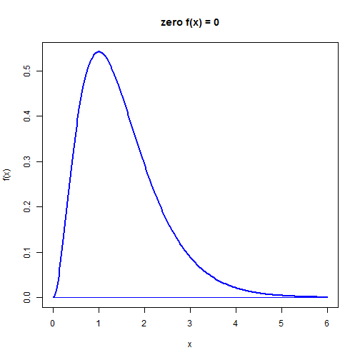
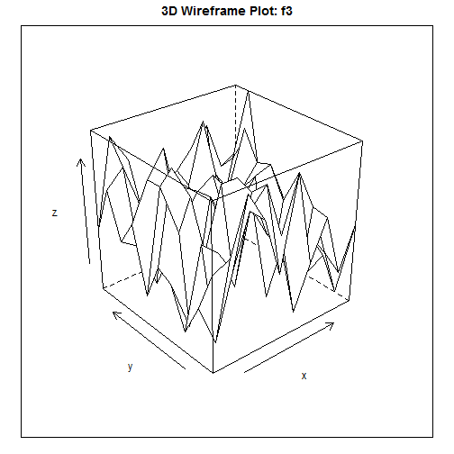
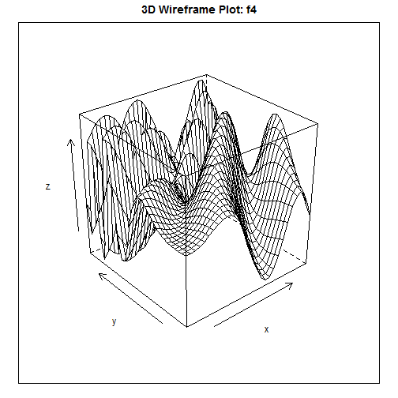

# Optimization

# 1 Univariate function optimization

## 1.1 Example function to be maximized 


```r
require(graphics)
rm(list = ls())  # Remove almost everything in the memory
```


Here we want to optimize a univariate function: f1


```r
f1simple = function(x) {
    # gamma(2,3) density
    if (x < 0) 
        return(c(0))
    if (x == 0) 
        return(c(NaN))
    y = exp(-2 * x)
    return(4 * x^2 * y)
}
```


Next we define the same function but return f(x), f'(x), and f''(x) 


```r
f1 = function(x) {
    # gamma(2,3) density
    if (x < 0) 
        return(c(0, 0, 0))
    if (x == 0) 
        return(c(0, 0, NaN))
    y = exp(-2 * x)
    return(c(4 * x^2 * y, 8 * x * (1 - x) * y, 8 * (1 - 2 * x^2) * y))
}
```


Some algorithms that we'll encounter later will minimize a function. So if we want to maximize our function we have to define it as a negate function, that is: $latex g(x) = -f(x)$ then $latex min(g(x))$ is the same as $latex max(f(x))$.


```r
f1simpleNeg = function(x) {
    # gamma(2,3) density
    if (x < 0) 
        return(c(0))
    if (x == 0) 
        return(c(NaN))
    y = exp(-2 * x)
    return(-(4 * x^2 * y))
}
```


Plotting the function is always a good idea!


```r
xmin = 0
xmax = 6
x = seq(xmin, xmax, (xmax - xmin)/200)
fx = c()  # define column vector
for (i in 1:length(x)) {
    fx[i] = f1(x[i])[1]
}
plot(x, fx, type = "l", xlab = "x", ylab = "f(x)", main = "zero f(x) = 0", 
    col = "blue", lwd = 2)
lines(c(xmin, xmax), c(0, 0), col = "blue")
```

 


## 1.2 Optimization methods

### 1.2.1 Newton's method


```r
newton = function(f3, x0, tol = 1e-09, n.max = 100) {
    # Newton's method for optimisation, starting at x0 f3 is a function that
    # given x returns the vector (f(x), f'(x), f''(x)), for some f
    
    x = x0
    f3.x = f3(x)
    n = 0
    while ((abs(f3.x[2]) > tol) & (n < n.max)) {
        x = x - f3.x[2]/f3.x[3]
        f3.x = f3(x)
        n = n + 1
    }
    if (n == n.max) {
        cat("newton failed to converge\n")
    } else {
        return(x)
    }
}
```


### 1.2.2 Golden section method


```r
gsection = function(ftn, x.l, x.r, x.m, tol = 1e-09) {
    # applies the golden-section algorithm to maximise ftn we assume that ftn
    # is a function of a single variable and that x.l < x.m < x.r and
    # ftn(x.l), ftn(x.r) <= ftn(x.m)
    # 
    # the algorithm iteratively refines x.l, x.r, and x.m and terminates when
    # x.r - x.l <= tol, then returns x.m
    
    # golden ratio plus one
    gr1 = 1 + (1 + sqrt(5))/2
    
    # successively refine x.l, x.r, and x.m
    f.l = ftn(x.l)
    f.r = ftn(x.r)
    f.m = ftn(x.m)
    while ((x.r - x.l) > tol) {
        if ((x.r - x.m) > (x.m - x.l)) {
            y = x.m + (x.r - x.m)/gr1
            f.y = ftn(y)
            if (f.y >= f.m) {
                x.l = x.m
                f.l = f.m
                x.m = y
                f.m = f.y
            } else {
                x.r = y
                f.r = f.y
            }
        } else {
            y = x.m - (x.m - x.l)/gr1
            f.y = ftn(y)
            if (f.y >= f.m) {
                x.r = x.m
                f.r = f.m
                x.m = y
                f.m = f.y
            } else {
                x.l = y
                f.l = f.y
            }
        }
    }
    return(x.m)
}
```


### 1.2.3 Built in 'optimize' function
There is a built in ```optimize``` function in R.

## 1.3 Maximize function: f1

### 1.3.1 Maximizing using the Newton method


```r
newton(f1, 0.25)
```

```
## [1] 1.979e-12
```

```r
newton(f1, 0.5)
```

```
## [1] 0
```

```r
newton(f1, 0.75)
```

```
## [1] 1
```

```r
newton(f1, 1.75)
```

```
## [1] 1
```


### 1.3.2 Maximizing using the Secant method


```r
gsection(f1simple, 0.1, 0.25, 1.3)
```

```
## [1] 1
```

```r
gsection(f1simple, 0.25, 0.5, 1.7)
```

```
## [1] 1
```

```r
gsection(f1simple, 0.6, 0.75, 1.8)
```

```
## [1] 1
```

```r
gsection(f1simple, 0, 2.75, 5)
```

```
## [1] 1
```


### 1.3.3 Maximizing using the built in optimize function


```r
optimize(f1simple, c(0.1, 1.3), maximum = TRUE)
```

```
## $maximum
## [1] 1
## 
## $objective
## [1] 0.5413
## 
```

```r
optimize(f1simple, c(0.25, 1.7), maximum = TRUE)
```

```
## $maximum
## [1] 1
## 
## $objective
## [1] 0.5413
## 
```

```r
optimize(f1simple, c(0.6, 1.8), maximum = TRUE)
```

```
## $maximum
## [1] 1
## 
## $objective
## [1] 0.5413
## 
```

```r
optimize(f1simple, c(0, 5), maximum = TRUE)
```

```
## $maximum
## [1] 1
## 
## $objective
## [1] 0.5413
## 
```


# 2 Multivariate optimization

## 2.1 Define multivariate (i.e. bivariate) example functions 

Here we want to optimize the following functions: f3, f4


### 2.1.1 Function f3 


```r
f3simple = function(x) {
    a = x[1]^2/2 - x[2]^2/4
    b = 2 * x[1] - exp(x[2])
    f = sin(a) * cos(b)
    return(f)
}
```


Its negative version: 


```r
f3simpleNeg = function(x) {
    a = x[1]^2/2 - x[2]^2/4
    b = 2 * x[1] - exp(x[2])
    f = -(sin(a) * cos(b))
    return(f)
}
```


And the version that returns f(x), f'(x) (i.e. the gradient), and f''(x) (i.e. the Hessian):


```r
f3 = function(x) {
    a = x[1]^2/2 - x[2]^2/4
    b = 2 * x[1] - exp(x[2])
    f = sin(a) * cos(b)
    f1 = cos(a) * cos(b) * x[1] - sin(a) * sin(b) * 2
    f2 = -cos(a) * cos(b) * x[2]/2 + sin(a) * sin(b) * exp(x[2])
    f11 = -sin(a) * cos(b) * (4 + x[1]^2) + cos(a) * cos(b) - cos(a) * sin(b) * 
        4 * x[1]
    f12 = sin(a) * cos(b) * (x[1] * x[2]/2 + 2 * exp(x[2])) + cos(a) * sin(b) * 
        (x[1] * exp(x[2]) + x[2])
    f22 = -sin(a) * cos(b) * (x[2]^2/4 + exp(2 * x[2])) - cos(a) * cos(b)/2 - 
        cos(a) * sin(b) * x[2] * exp(x[2]) + sin(a) * sin(b) * exp(x[2])
    return(list(f, c(f1, f2), matrix(c(f11, f12, f12, f22), 2, 2)))
}  # Function f3 returns: f(x), f'(x), and f''(x)
```


Plot function f3:


```r
library("lattice")
x = c()
y = c()
z = c()
i = 1  ## Make data for wireframe command
for (x0 in seq(1, 10, 1)) {
    for (y0 in seq(1, 10, 1)) {
        x[i] = x0
        y[i] = y0
        z[i] = f3simple(c(x[i], y[i]))
        i = i + 1  # data counter
    }
}
wireData = data.frame(x = x, y = y, z = z)
wireframe(z ~ x * y, main = "3D Wireframe Plot: f3", xlab = "x", 
    ylab = "y", data = wireData)
```

 


### 2.1.2 Function f4 

This is the same function, but in its output for f'(x) and f''(x) we use the built in ```deriv()``` function so that we don't have to derive the function by hand.


```r
f4simple = function(x) {
    ## Rosenbrock Banana function
    a = x[1]^2/2 - x[2]^2/4
    b = 2 * x[1] - exp(x[2])
    f = sin(a) * cos(b)
    return(f)
}

f4simpleNeg = function(x) {
    ## Rosenbrock Banana function
    a = x[1]^2/2 - x[2]^2/4
    b = 2 * x[1] - exp(x[2])
    f = -sin(a) * cos(b)
    return(f)
}

Dfx = deriv(z ~ sin(x^2/2 - y^2/4) * cos(2 * x - exp(y)), c("x", 
    "y"), func = TRUE, hessian = TRUE)
f4 = function(x) {
    Dfx = Df(x[1], x[2])
    f = Dfx[1]
    gradf = attr(Dfx, "gradient")[1, ]
    hessf = attr(Dfx, "hessian")[1, , ]
    return(list(f, gradf, hessf))
}
```


Plot function f4:


```r
x = c()
y = c()
z = c()
i = 1  ## Make data for wireframe command
for (x0 in seq(0, 3, 0.1)) {
    for (y0 in seq(0, 3, 0.1)) {
        x[i] = x0
        y[i] = y0
        z[i] = f4simple(c(x[i], y[i]))
        i = i + 1  # data counter
    }
}
wireData = data.frame(x = x, y = y, z = z)
wireframe(z ~ x * y, main = "3D Wireframe Plot: f4", xlab = "x", 
    ylab = "y", data = wireData)
```

 


## 2.2 Multivariate optimization methods

### 2.2.1 Newton


```r
newtonMult = function(f3, x0, tol = 1e-09, n.max = 100) {
    # Newton's method for optimisation, starting at x0 f3 is a function that
    # given x returns the list {f(x), grad f(x), Hessian f(x)}, for some f
    
    x = x0
    f3.x = f3(x)
    n = 0
    while ((max(abs(f3.x[[2]])) > tol) & (n < n.max)) {
        x = x - solve(f3.x[[3]], f3.x[[2]])
        f3.x = f3(x)
        n = n + 1
    }
    if (n == n.max) {
        cat("newton failed to converge\n")
    } else {
        return(x)
    }
}
```


### 2.2.2 Built in optim() function

## 2.3 Maximize multivariate function

We use various starting values to see whether we can find more than one optimum.


```r
for (x0 in seq(1.4, 1.6, 0.1)) {
    for (y0 in seq(0.4, 0.6, 0.1)) {
        cat("Newton: f3", c(x0, y0), "-->", newtonMult(f3, c(x0, y0)), "\n")  # This algorithm requires f(x), f'(x), and f''(x)
        cat("Optim:  f3", c(x0, y0), "-->", optim(c(x0, y0), f3simpleNeg)[[1]], 
            "\n")
        cat(" ----------------------------------------- \n")
    }
}
```

```
## Newton: f3 1.4 0.4 --> 0.04074 -2.507 
## Optim:  f3 1.4 0.4 --> 2.031 1.402 
##  ----------------------------------------- 
## Newton: f3 1.4 0.5 --> 0.118 3.345 
## Optim:  f3 1.4 0.5 --> 2.031 1.402 
##  ----------------------------------------- 
## Newton: f3 1.4 0.6 --> -1.553 6.02 
## Optim:  f3 1.4 0.6 --> 2.031 1.402 
##  ----------------------------------------- 
## Newton: f3 1.5 0.4 --> 2.837 5.354 
## Optim:  f3 1.5 0.4 --> 2.031 1.402 
##  ----------------------------------------- 
## Newton: f3 1.5 0.5 --> 0.04074 -2.507 
## Optim:  f3 1.5 0.5 --> 2.031 1.402 
##  ----------------------------------------- 
## Newton: f3 1.5 0.6 --> 9.899e-10 1.366e-09 
## Optim:  f3 1.5 0.6 --> 2.031 1.402 
##  ----------------------------------------- 
## Newton: f3 1.6 0.4 --> -0.5584 -0.7897 
## Optim:  f3 1.6 0.4 --> 2.031 1.402 
##  ----------------------------------------- 
## Newton: f3 1.6 0.5 --> -0.2902 -0.2305 
## Optim:  f3 1.6 0.5 --> 2.031 1.402 
##  ----------------------------------------- 
## Newton: f3 1.6 0.6 --> -1.553 -3.333 
## Optim:  f3 1.6 0.6 --> 2.031 1.402 
##  ----------------------------------------- 
```


```r
for (x0 in seq(0, 0.5, 0.1)) {
    for (y0 in seq(0, 0.5, 0.1)) {
        cat("Newton: f3", c(x0, y0), "-->", newtonMult(f3, c(x0, y0)), "\n")  # This algorithm requires f(x), f'(x), and f''(x)
        cat("Optim:  f4", c(x0, y0), "-->", optim(c(x0, y0), f4simpleNeg)[[1]], 
            "\n")
        cat(" ----------------------------------------- \n")
    }
}
```

```
## Newton: f3 0 0 --> 0 0 
## Optim:  f4 0 0 --> 2.031 1.402 
##  ----------------------------------------- 
## Newton: f3 0 0.1 --> 2.479e-11 2.658e-11 
## Optim:  f4 0 0.1 --> 2.031 1.402 
##  ----------------------------------------- 
## Newton: f3 0 0.2 --> -0.5584 -0.7897 
## Optim:  f4 0 0.2 --> 2.031 1.402 
##  ----------------------------------------- 
## Newton: f3 0 0.3 --> -0.1592 0.2251 
## Optim:  f4 0 0.3 --> 0.3425 1.427 
##  ----------------------------------------- 
## Newton: f3 0 0.4 --> -0.1592 0.2251 
## Optim:  f4 0 0.4 --> 0.3425 1.427 
##  ----------------------------------------- 
## Newton: f3 0 0.5 --> -0.1592 0.2251 
## Optim:  f4 0 0.5 --> 0.3425 1.427 
##  ----------------------------------------- 
## Newton: f3 0.1 0 --> 2.875e-10 2.262e-10 
## Optim:  f4 0.1 0 --> 2.031 1.402 
##  ----------------------------------------- 
## Newton: f3 0.1 0.1 --> 2.385e-13 2.453e-13 
## Optim:  f4 0.1 0.1 --> 2.031 1.402 
##  ----------------------------------------- 
## Newton: f3 0.1 0.2 --> 1.598e-13 1.837e-13 
## Optim:  f4 0.1 0.2 --> 2.031 1.402 
##  ----------------------------------------- 
## Newton: f3 0.1 0.3 --> -0.5584 -0.7897 
## Optim:  f4 0.1 0.3 --> 2.031 1.402 
##  ----------------------------------------- 
## Newton: f3 0.1 0.4 --> -0.1592 0.2251 
## Optim:  f4 0.1 0.4 --> 0.3425 1.427 
##  ----------------------------------------- 
## Newton: f3 0.1 0.5 --> 4.93 4.147 
## Optim:  f4 0.1 0.5 --> 0.3425 1.427 
##  ----------------------------------------- 
## Newton: f3 0.2 0 --> 2.073e-14 1.71e-14 
## Optim:  f4 0.2 0 --> 2.031 1.402 
##  ----------------------------------------- 
## Newton: f3 0.2 0.1 --> 8.943e-16 8.452e-16 
## Optim:  f4 0.2 0.1 --> 2.031 1.402 
##  ----------------------------------------- 
## Newton: f3 0.2 0.2 --> 2.07e-10 2.225e-10 
## Optim:  f4 0.2 0.2 --> 2.031 1.402 
##  ----------------------------------------- 
## Newton: f3 0.2 0.3 --> -1.653e-17 -3.075e-17 
## Optim:  f4 0.2 0.3 --> 2.031 1.402 
##  ----------------------------------------- 
## Newton: f3 0.2 0.4 --> -25.13 -48.35 
## Optim:  f4 0.2 0.4 --> 2.031 1.402 
##  ----------------------------------------- 
## Newton: f3 0.2 0.5 --> 0.3428 0.6699 
## Optim:  f4 0.2 0.5 --> 2.031 1.402 
##  ----------------------------------------- 
## Newton: f3 0.3 0 --> 7.607e-14 5.27e-14 
## Optim:  f4 0.3 0 --> 2.031 1.402 
##  ----------------------------------------- 
## Newton: f3 0.3 0.1 --> 1.618e-13 1.43e-13 
## Optim:  f4 0.3 0.1 --> 2.031 1.402 
##  ----------------------------------------- 
## Newton: f3 0.3 0.2 --> 2.026e-14 1.999e-14 
## Optim:  f4 0.3 0.2 --> 2.031 1.402 
##  ----------------------------------------- 
## Newton: f3 0.3 0.3 --> 1.832e-09 2.112e-09 
## Optim:  f4 0.3 0.3 --> 2.031 1.402 
##  ----------------------------------------- 
## Newton: f3 0.3 0.4 --> 1.059e-13 9.414e-14 
## Optim:  f4 0.3 0.4 --> 2.031 1.402 
##  ----------------------------------------- 
## Newton: f3 0.3 0.5 --> 2.023 3.804 
## Optim:  f4 0.3 0.5 --> 2.031 1.402 
##  ----------------------------------------- 
## Newton: f3 0.4 0 --> 1.639e-09 1.885e-09 
## Optim:  f4 0.4 0 --> 2.031 1.402 
##  ----------------------------------------- 
## Newton: f3 0.4 0.1 --> 6.77e-10 -3.265e-09 
## Optim:  f4 0.4 0.1 --> 2.031 1.402 
##  ----------------------------------------- 
## Newton: f3 0.4 0.2 --> 7.305e-14 6.631e-14 
## Optim:  f4 0.4 0.2 --> 2.031 1.402 
##  ----------------------------------------- 
## Newton: f3 0.4 0.3 --> 3.261e-14 3.352e-14 
## Optim:  f4 0.4 0.3 --> 2.031 1.402 
##  ----------------------------------------- 
## Newton: f3 0.4 0.4 --> 5.718e-10 7.896e-10 
## Optim:  f4 0.4 0.4 --> 2.031 1.402 
##  ----------------------------------------- 
## Newton: f3 0.4 0.5 --> 2.553e-17 3.03e-17 
## Optim:  f4 0.4 0.5 --> 2.031 1.402 
##  ----------------------------------------- 
## Newton: f3 0.5 0 --> -0.2902 -0.2305 
## Optim:  f4 0.5 0 --> 2.031 1.402 
##  ----------------------------------------- 
## Newton: f3 0.5 0.1 --> 3.2e-10 3.906e-10 
## Optim:  f4 0.5 0.1 --> 2.031 1.402 
##  ----------------------------------------- 
## Newton: f3 0.5 0.2 --> 3.109e-17 2.973e-17 
## Optim:  f4 0.5 0.2 --> 2.031 1.402 
##  ----------------------------------------- 
## Newton: f3 0.5 0.3 --> 5.537e-16 4.978e-16 
## Optim:  f4 0.5 0.3 --> 2.031 1.402 
##  ----------------------------------------- 
## Newton: f3 0.5 0.4 --> 2.905e-15 3.159e-15 
## Optim:  f4 0.5 0.4 --> 2.031 1.402 
##  ----------------------------------------- 
## Newton: f3 0.5 0.5 --> 3.686e-11 5.179e-11 
## Optim:  f4 0.5 0.5 --> 2.031 1.402 
##  ----------------------------------------- 
```


